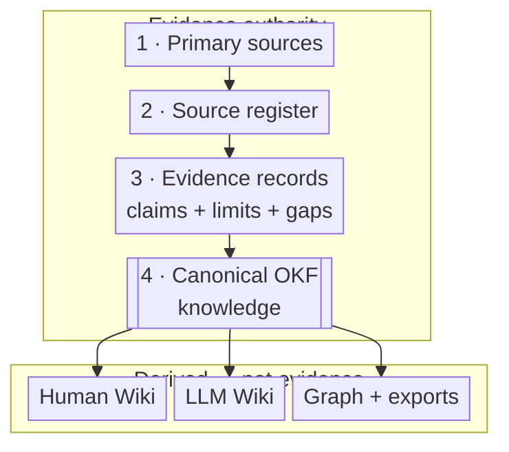

# Standard architecture

## Canonical layers

1. **Raw sources** — immutable or content-addressed source material.
2. **Staging** — optional deterministic extraction, OCR, transcription, or normalization.
3. **Evidence governance** — source register, evidence matrix, validation queue, and research log.
4. **Canonical knowledge** — the first-class `knowledge/` OKF v0.2 bundle plus normative specification and structured records. The explicit bundle boundary avoids falsely treating renderer navigation files as OKF concepts.
5. **Human Wiki** — first-class Zensical site using the DenchCo visual profile.
6. **LLM Wiki** — compact routing, context, maintenance, ingest, query, and lint instructions.
7. **Discovery outputs** — `llms.txt`, indexes, search, Graphify 2D/3D, and optional lossless JSON interchange exports of the canonical OKF bundle.
8. **Conformance** — schemas, deterministic checks, browser evidence, fixtures, and reports.
9. **Operations** — Git, Jujutsu phases, stable local runtime, CI, release, deployment, and migration.

Inspect these relationships through the shared [2D and 3D repository graph](graph/index.md). The graph is a generated discovery layer and never outranks the authority chain below.

## Authority

Solid accent marks canonical authority. Dashed node boundaries mark derived surfaces: they assist comprehension, routing, and discovery but cannot create evidence.

## Distribution boundary

The distribution has three deliberately separate roles:

1. **Normative standard repository** — specifications, profiles, schemas, prompts, tooling, and the subject-empty starter contract at <https://github.com/denchco/knowledge-base-wiki-standard>.
2. **Public documentation** — explanatory help and examples at <https://denchco.github.io/knowledge-base-wiki-documentation/>; schema endpoints are mirrored there for discovery, not runtime validation.
3. **Independent consumer repository** — the subject's own sources, canonical knowledge, Human and LLM Wikis, URL, deployment, and deviations, pinned to one immutable standard revision.

The standard root is never copied wholesale. `starter/starter.yaml` is the allowlist: templates are subject-empty, subject content is created fresh, and selected implementation adapters are reviewed against the pinned release. Consumer validation uses pinned local schemas and remains available if the documentation site is offline.

## Human and LLM products

The Human Wiki and LLM Wiki share canonical knowledge. The Human Wiki optimizes comprehension, navigation, decisions, diagrams, and evidence inspection. The LLM Wiki optimizes context selection, maintenance discipline, machine-readable routing, and bounded workflows. Neither is maintained as an independent duplicate corpus.
