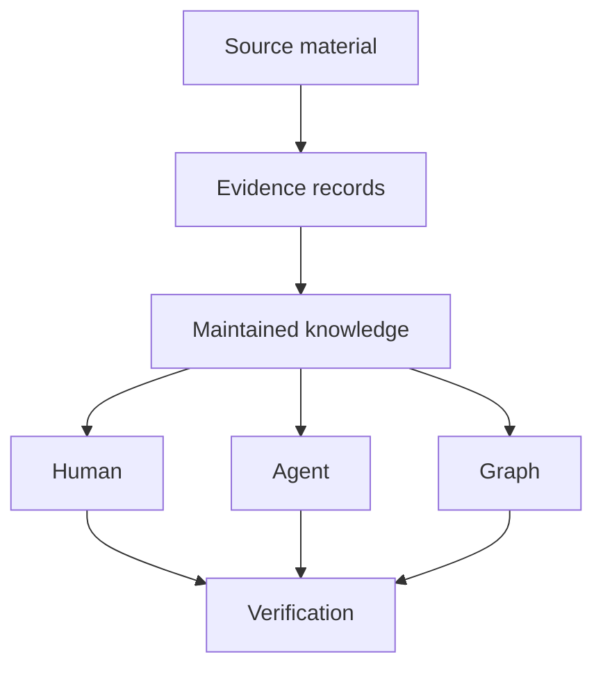

# DenchCo Knowledge Base Wiki Standard

Public human documentation is published at <https://denchco.github.io/knowledge-base-wiki-documentation/>. This repository remains the normative source; the public site is explanatory.

<blockquote class="governing-question">

How should a durable knowledge base serve humans and AI agents while remaining portable, evidence-grounded, inspectable, and safely updateable?

</blockquote>

Use an OKF-compatible canonical Markdown knowledge layer; add explicit evidence governance; publish coordinated Human and LLM Wikis; render the Human Wiki with Zensical and the DenchCo visual profile; expose relationships through Graphify; and prove every claimed capability through executable conformance checks.

## The system

Read from top to bottom: source material becomes inspectable evidence, then maintained knowledge. That shared knowledge directly serves three separately presented surfaces: the Human Wiki, the LLM Wiki for agents, and Graphify. Each path then converges on verification. The boxes are views over one corpus, not independent knowledge stores. The labels, order, and this explanation carry the authority distinction without custom node styling.

## Start here

- To create an independent wiki, give an AI agent only <https://github.com/denchco/knowledge-base-wiki-standard>. The repository's canonical prompt begins an adaptive seed-or-subject-empty interview and infers routine local defaults.
- [Architecture](architecture.md) explains the complete system.
- [Normative specification](spec/index.md) defines conformance.
- [Requirements](spec/requirements.md) provides stable rule identifiers.
- [Profiles](spec/profiles.md) separates core portability from optional capabilities.
- [Agent entry point](llm-wiki/index.md) gives Codex and other agents the minimum reliable context.
- [Tools and sources](reference/tools-and-sources.md) records upstream authority.
- The subject-empty `starter/starter.yaml` recipe creates independent knowledge bases without copying this standard's topic content.
- [Propose a reusable standard change](llm-wiki/standard-proposals.md) preserves a consumer improvement in a tracked record and keeps intake, Standard acceptance, release, and optional adoption as separate authorised states.

## Governed implementation

- [Dependencies](spec/dependencies.md) and [security/source boundaries](spec/security-and-sources.md) define the executable and trust perimeter.
- [Prompt rules](spec/prompts.md), [LLM maintenance](llm-wiki/maintenance.md), and the [context map](llm-wiki/context-map.md) govern repeatable agent work.
- Development responses navigate Wiki content through the configured live canonical HTTP(S) origin; file and editor links never substitute for rendered Wiki routes.
- [Sources](sources.md), the [evidence matrix](evidence-matrix.md), [validation queue](validation-queue.md), and [research log](log.md) keep authority and uncertainty inspectable.
- [Roadmap](roadmap.md), [project status](project/status.md), and [local precedents](reference/local-precedents.md) separate completed candidate work from remaining release decisions.
- [Conformance evidence](conformance/index.md) keeps formal declarations distinct from inferred dogfood audits.

This repository is at candidate status. Do not claim public release conformance until the GitHub release and migration workflow are completed.
