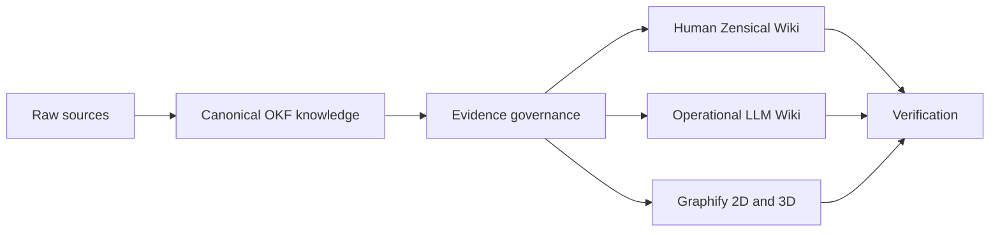

# DenchCo Knowledge Base Wiki Standard

> How should a durable knowledge base serve humans and AI agents while remaining portable, evidence-grounded, inspectable, and safely updateable?

Use an OKF-compatible canonical Markdown knowledge layer; add explicit evidence governance; publish coordinated Human and LLM Wikis; render the Human Wiki with Zensical and the DenchCo visual profile; expose relationships through Graphify; and prove every claimed capability through executable conformance checks.

## The system

## Start here

- [Architecture](architecture.md) explains the complete system.
- [Normative specification](spec/index.md) defines conformance.
- [Requirements](spec/requirements.md) provides stable rule identifiers.
- [Profiles](spec/profiles.md) separates core portability from optional capabilities.
- [Agent entry point](llm-wiki/index.md) gives Codex and other agents the minimum reliable context.
- [Tools and sources](reference/tools-and-sources.md) records upstream authority.

This repository is at candidate status. Do not claim public release conformance until the GitHub release and migration workflow are completed.
